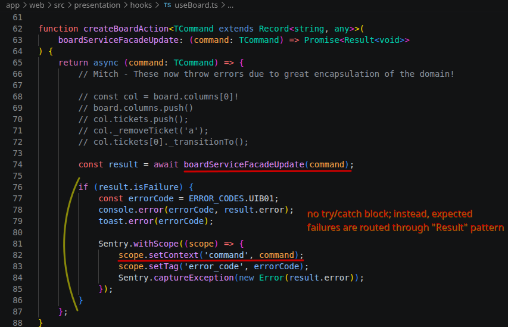
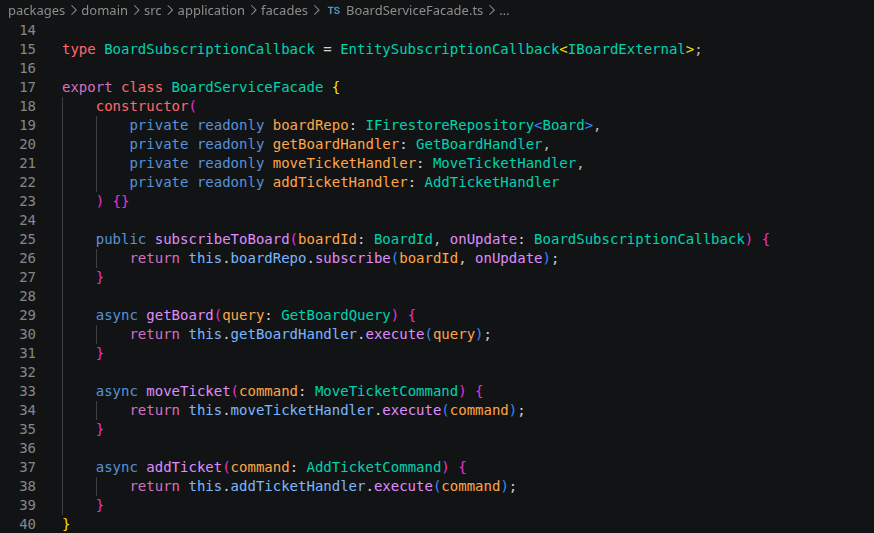
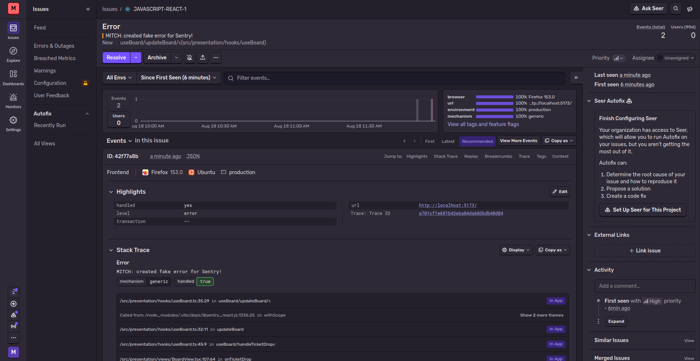
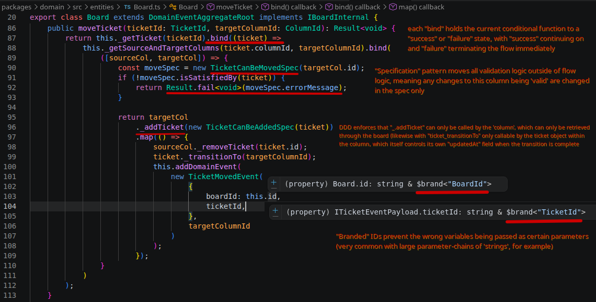
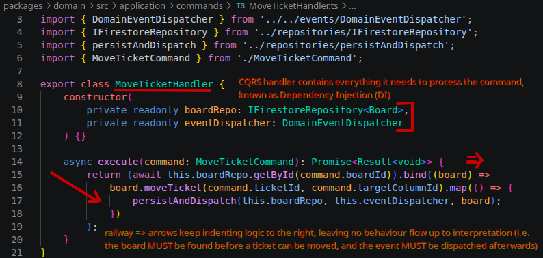
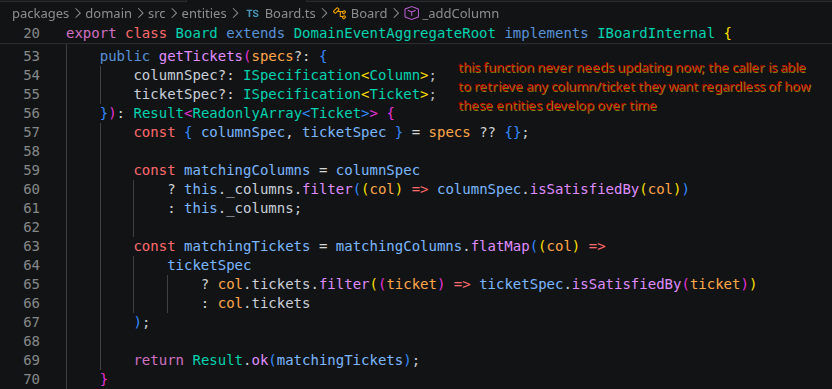
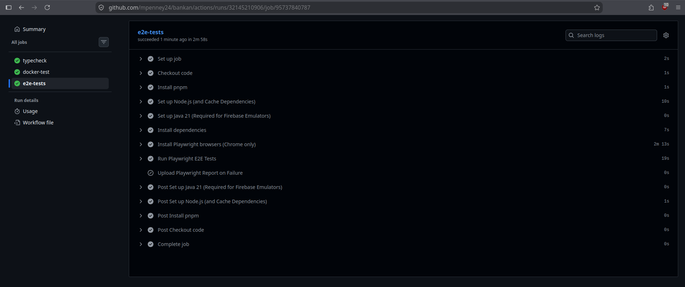

# Bankan - "Doing What's Done, Differently" 🚀

Hello there, and welcome to Bankan!

## 📌 Table of Contents

- About the Project
- Built With
- Features
- Design Patterns and Principles
- Screenshots / Demo

---

## 📖 About The Project

Functional programming has been a part of my life for the best part of 3 years now, but to truly test my understanding of the concept I wanted to challenge myself to build something new. It was while trying to plan this project that I realised, unlike when I was part of a workforce, I had no "Jira" or equivalent tool to plan/track the progress of this project with... which gave me an idea.

> "What if I could take the foundations of a well-known productivity and project-management tool (in this case, the humble Kanban board) and make one for myself in a totally functional way?"

Thus, Bankan was born.

> CONTEXT:
>
> A Kanban board is a productivity/project-management tool which allows individuals to create, edit, and move specified tickets (of refined work items) across pre-defined columns (or "swim-lanes") to mark a significant milestone of a ticket's overall progression. A ticket generally begins its journey on the furthest left of the board (likely a "backlog" state) where it is assigned to an individual (or group of individuals) and sequentially moved from left-to-right as the item is worked on, terminating in a signed-off (or "done") state to the furthest-right. Eventually - whether before/after peer reviews, user/product-owner acceptance, or even deployment - the work item is considered satisfied and the ticket itself is archived and removed from the board.

From a brief consideration of Kanban we can naturally see each object, workflow, and actor reveal itself to us: Boards; Columns; Tickets; Descriptions; Priorities; States; Statuses; Adding; Removing; the list goes on. 

There are no doubt many multitudes of means and methods of fulfilling such a system (perhaps even infinitely so!) but there was one key insight that came to my attention -- one that swiftly became the driving motivator for this entire project:

> "If a ticket cannot exist without a column, and a column cannot exist without a board, what if the system could be designed as one unified entity: a central aggregate where all data resides and all behaviour unfolds, maintaining the strictest level of encapsulation while still enabling mutations, reads, and removals at the correct hierarchical point?"

This idea is known as Domain-Driven Design (DDD), and it thinks about software in a very different way to architectural design patterns I'd encountered up until this point in my career. 

It posits that a system can be composed of something called an Aggregate Root: an entity which gatekeeps the orchestration of all other entities residing within its Domain, while at the same time keeping business logic decoupled by routing all interactions to these inner entities through commands, queries, and services at the top level...

It all sounded very challenging, yet at the same time very plausible. I wondered what such a system might look like...

Then I decided to wonder no longer, and got to work.

Over the course of the project I ended up implementing *much more* than just DDD alone (because scope creep is inevitable in the pursuit of curiosity) culminating in a Typescript-based React project which (hopefully!) represents some of the best practices we have today, namely:

> 1. Domain-Drive Design (DDD)
> 2. A lightweight and responsive React UI
> 3. A document-based Google Firestore db (with associated repositories and Firestore converter)
> 4. Custom Zod-based runtime validation (and schema composition) fed directly into the converter for object de- and re-hydration.
> 5. Domain Event Dispatch modelling (including asynchronous read-only summary data and lightweight versions of models for querying/monitoring)
> 6. Result/Specification/Branded Type patterns)
> 7. Command Query Responsibility Segregation (CQRS) to separate read/write concerns
> 8. Optimistic Concurrency Control (OCC) to keep the UI lightning-fast (and roll back changes, such as failing to add a new ticket or move a ticket to a different column)
> 9. Railway-oriented Programming, using monads to dictate control flow rather than exception-handling blocks (an anti-pattern these days)

Overall, I'm happy with what I accomplished in the space of 2 weeks' development time, and I feel I've made a robust, well-encapsulated, architecturally sound bit of code. Some if it has been slightly over-engineered for portfolio purposes, but I discuss that further in **Design Patterns and Principles** below.

Any changes or corrections (or even criticisms) are very welcome, as I'm sure there are still things I have missed or could have done better. This project was a learning process, after all, and I intend to keep learning.

Thanks very much for your time!

Mitch

---

## 🛠️ Built With

- [TypeScript](https://www.typescriptlang.org/)
- [Node.js](https://nodejs.org/)
- [Google Firestore](https://firebase.google.com/)
- [React](https://react.dev/)
- [Zod](https://zod.dev/)
- [Vitest](https://vitest.dev/)

---

## ✨ Features

Some parts of the project to pay attention to:

- **Domain-Driven Design (DDD):** - _Board.ts_, the Aggregate Root of this project
- **Real-time Database:** - _FirestoreRepository.ts_, for seamless reads and writes with a document-based db
- **Robust DI Testing:** - See the many Vitest x.test.ts files incorporating Dependency Injection and effective mocking (unit tests only, but int tests could be added!)
- **Zod validation:** - _firestoreConverter.ts_, to see run-time Zod schema validation (both to/from the db, as it's easy for data to become stale with overlooked application updates!)
- **React UI:** - _BoardView.tsx_ and _useBoard.ts_, the lightning-fast form and hook which subscribes to domain updates and allows the drag/drop of tickets between columns, as well as ticket creation
- **In-memory Event Dispatching:** - _DomainEventDispatcher.ts_, to see event payloads pushed to the console (could be funneled into monitoring for system health or usage statistics)

---

## 🖊️ Design Patterns and Principles

Examples and explanations of some new development techniques I learned to complete this project.

- **Command Query Responsibility Segregation (CQRS)**

Admittedly, introducing this pattern was a bit overkill for the scope of this project. Originally, I had planned to introduce a message broker (such as ActiveMQ) to record individual events happening on the Bankan board (such as MoveTicket, AddTicket) and store these to rebuild the board via event-sourcing. However, it quickly became apparent that an Aggregate Root would be subjected to new events *all the time*, meaning the app would have to layer hundreds (if not thousands!) of events on top of each other to reconstruct the latest board. Event-sourcing is better suited for something like Amazon or Ticketmaster, where orders move through states of mutation and progress on their way to a planned termination (and therefore have much smaller numbers and types of events)

However, I was able to repurpose this idea for monitoring purposes, using Sentry to listen for these commands and record any failures that might happen:
  1. DDD encapsulation is so strong that no mutations can take place unless going through the right pathways (Board -> Column -> Ticket), and even then only the BoardServiceFacade has the ability to initiate any changes to the board.

  

    
    
  

  2. Function is also generic, handling all errors by notifying the user on the UI (via "toast") while simultaneously sending the result to Sentry to be recorded/monitored. Many errors happening within quick succession (or reaching a specified limit) will push notifications to the dev team to warn them there might be a system fault.

  

  3. "Result" pattern moves application flow control out of try/catch blocks, cleaning up code while also creating a clear distinction between expected behaviour and genuine system faults. Error handling is left for "real" errors.

  

- **Railway-oriented Monads (and "Result"/"Specification"/"Branded ID" patterns)**

Reducing boilerplate code further, Railway-oriented monads help streamline execution flows by keeping code in-line and clearly indented while the "Result" pattern keeps track of the process by binding/mapping the result of the previous execution.

  

Likewise, combining this technique with the "Specification" pattern abstracts all conditional logic entirely, keeping the conditions which "satisfy" the railway execution solely within the entity itself, and instead we switch on a "isSatisfiedBy(X)" check.

  

- **Docker Containerised CD/CI and E2E Pipelines**

Successfully separated out the different components of the application into their own pipeline steps via ci.yml, allowing GitHub to pick up any errors in sequence to fail fast (i.e. if we can't even compile the code, why bother spinning up any containers?) and create a Docker image for Vercel to automatically detect and deploy once the build has gone green.  

---

## 📸 Screenshots / Demo

  
  
  
  

Video:
https://github.com/user-attachments/assets/d78ff84e-b6fb-44e7-a127-593106b3abc4

