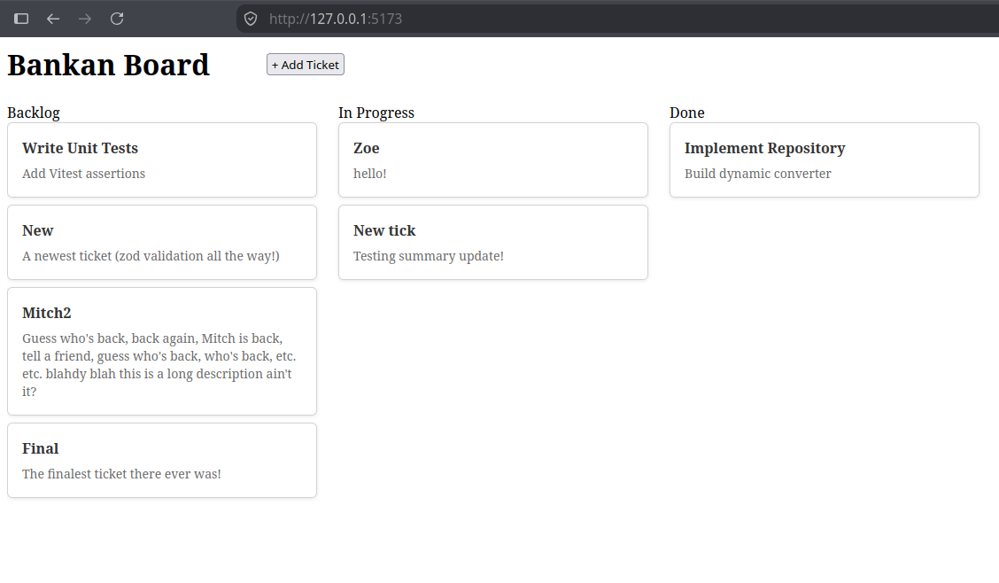
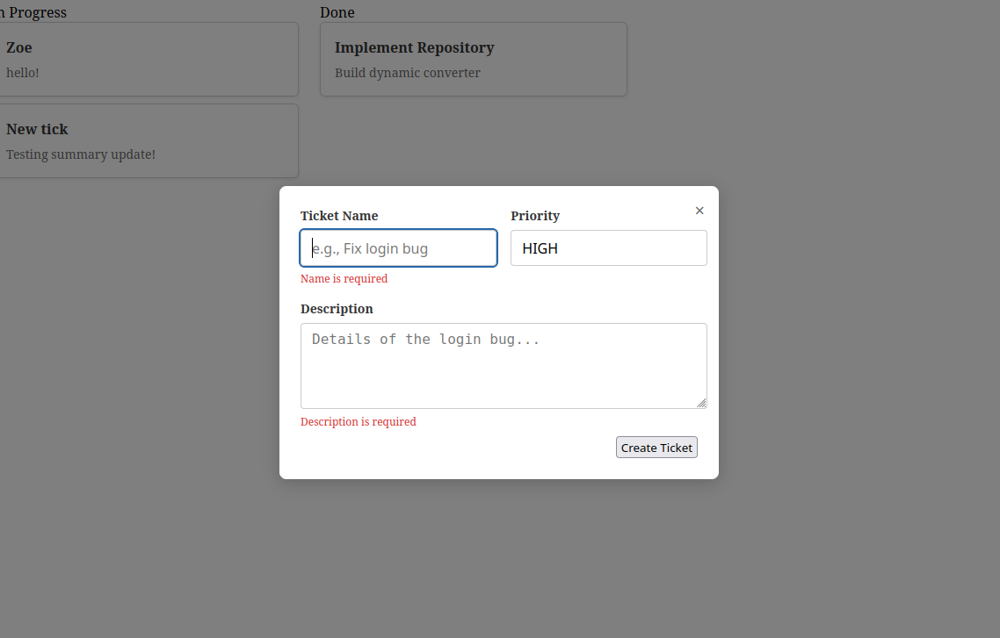
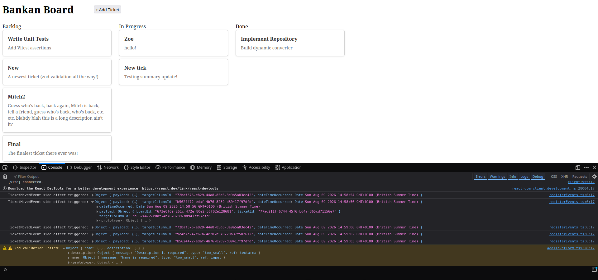
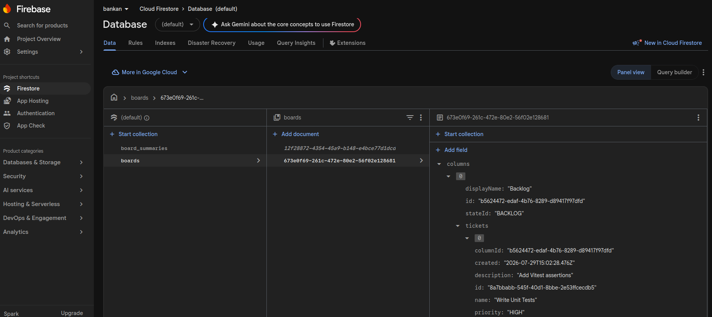
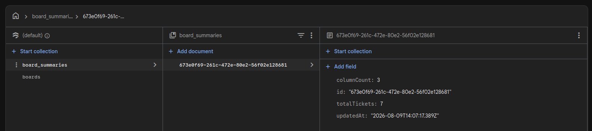

# Bankan - "Doing What's Done, Differently" 🚀

Hello there, and welcome to Bankan!

## 📌 Table of Contents
- About the Project
- Built With
- Features
- Screenshots / Demo

---

## 📖 About The Project

Functional programming has been a part of my life for the best part of 3 years now, but to truly test my understanding I wanted to take a well-known concept (in this case, the humble Kanban board) and build it in a totally new way to me.

> CONTEXT:
>
> A Kanban board is a productivity/project-management tool which allows individuals to create, edit, and move specified tickets (of refined work items) across pre-defined columns (or "swim-lanes"), each one representing a significant milestone of the ticket's overall progression. In operation, a ticket generally begins its journey on the furthest left of the board (likely a "backlog" state) where it is assigned to an individual (or group of individuals) and sequentially moved from left-to-right as the item is worked on, ending its journey in a signed-off (or "done") state at the furthest right of the board. Eventually - after peer reviews, user/product-owner acceptance, or perhaps even deployment - the work item is considered satisfied, and the ticket itself is archived and removed from the board.

From a brief consideration of Kanban we can naturally see the objects, workflows and actors reveal themselves to us. There are no doubt many multitudes of means and methods of fulfilling such a system (perhaps even infinitely so!) but one key insight of its construction came to my attention... one that swiftly became the driving motivator for this entire project:

> "If a ticket cannot exist without a column, and a column cannot exist without a board, what if the system could be designed as one unified entity: a central aggregate where all data resides and all behaviour unfolds, maintaining the strictest level of encapsulation possible while still adhering to coding guidelines and standards?"

This idea is known as Domain-Driven Design (DDD), and it thinks about software in a very different way to architectural design patterns I've encountered thus far in my career. It posits that systems can be composed of aggregate root entities which gatekeeper the orchestration of the entities existing within their domain, while at the same keeping business logic and other application behaviours decoupled by routing all aggregate interactions through commands, queries, and services.

It all sounded very challenging, yet at the same time very plausible. I wondered what such a system might look like.

And then I wondered... could *I* make such a system?

Thus, was the Bankan project born.

Over the course of the project I ended up implementing much more than just DDD (because scope creep is always inevitable in the pursuit of curiosity), periodically introducing new architectural designs, patterns, and other features I had been learning about recently, culminating in a Typescript-based React project which (hopefully!) represents some of the best practices we have today, namely:

> 1. Domain-Drive Design (DDD)
> 2. A lightweight and responsive React UI
> 3. A document-based Google Firestore db (with associated repositories and Firestore converter, maintaining Typescript domain model integrity [such as underscores for variable names])
> 4. Custom Zod-based runtime validation (and schema composition) fed directly into the converter for object de-/re-hydration.
> 5. Domain Event Dispatch modelling (including asynchronous read-only summary data, creating lightweight models for querying/monitoring [were this app to go into production])
> 6. Result/Specification patterns (one for creating success/failure chaining, the other to handle scope increase and "function creep", such as findByX, findByXandY, etc.)
> 7. Command Query Responsibility Segregation (CQRS) to separate read/write concerns
> 8. Optimistic Concurrency Control (OCC) to keep the UI lightning-fast while db updates complete in the background happen (and roll the board back, such as failing to save a ticket moving to a new column)
> 9. Branded Types (to prevent parameter-chain order issues, such as introducing bugs through mixing up which "string" id goes where [which, let's face it, we've all done before!])
> 10. Railway-oriented Programming, utilising monads to prevent control flow being dictated by exception-handling blocks 

Overall, I'm happy with what I accomplished in the space of 2 weeks' development time, and I feel I've made a robust, well-encapsulated, and architecturally sound bit of code!

Any changes or corrections (or criticisms!) are of course welcome, as I'm sure there are still things I have missed or could have done better. This project was a learning process, after all, and I intend to keep learning.

Thanks very much!

Mitch

---

## 🛠️ Built With

* [TypeScript](https://www.typescriptlang.org/)
* [Node.js](https://nodejs.org/)
* [Google Firestore](https://firebase.google.com/)
* [React](https://react.dev/)
* [Zod](https://zod.dev/)
* [Vitest](https://vitest.dev/)

---

## ✨ Features

Some parts of the project to pay attention to:
* **Domain-Driven Design (DDD):** Board.ts, the Aggregate Root of this project
* **Real-time Database:** FirestoreRepository.ts, for seamless reads and writes with a document-based db
* **Robust DI Testing:** See the many Vitest x.test.ts files incorporating Dependency Injection and effective mocking (unit tests only, but int tests could be added!)
* **Zod validation:** firestoreConverter.ts, to see run-time Zod schema validation (both to/from the db, as it's easy for data to become stale with overlooked application updates!)
* **React UI:** BoardView.tsx and useBoard.ts, the lightning-fast form and hook which subscribes to domain updates and allows the drag/drop of tickets between columns, as well as ticket creation
* **In-memory Event Dispatching:** DomainEventDispatcher.ts, to see event payloads pushed to the console (could be funneled into monitoring for system health or usage statistics)

---

## 📸 Screenshots / Demo

Add visual proof of your app working!

  
  
  
  
  
  

